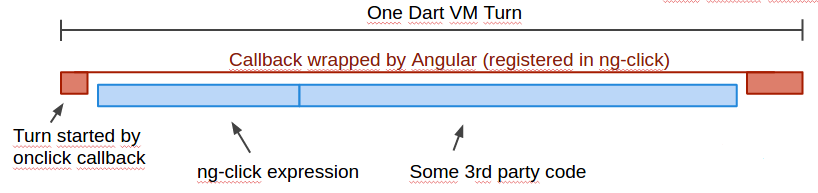
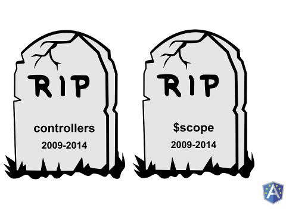

## AngularDart 1.0 and beyond!

[Pierre Reliquet](http://github.com/PierreReliquet) - @preliquet

Consultant [@ZenikaIT](http://zenika.com/)


## Agenda

1. Dart, a quick tour
1. AngularDart
1. What's in the future?


<figure>
  <a href="http://www.dartlang.org"></a>
</figure>


## What ?

* `Modern web` programming language
* `Client` and `server` side
* Open source and `standardized` (ECMA-408)
* One of the `20 most popular programming language`
* Developped and supported by `Google`
* Ships with a whole `ecosystem`

<figure>
   
</figure>


## It is familiar

```Dart
@Injectable()
class Conference {
  List<Attendee> attendees = []; // var attendees = [];

  Conference(this.attendees);
  Conference operator +(Conference other) {
    return new Conference(this.attendees + other.attendees);
  }
  void askQuestions({int number :1}) { ... }
  String toString() => "${attendees.length} attendees participated to the conference";
}
```


## Many great things

* dart2js
* Tree shaking
* Futures
* Generics
* Isolates
* Deferred loading


<figure>
	<a href="http://angulardart.org"></a>
</figure>


## The birth

* `Enhancing` of Google internal CRM
* Legacy : `Java` / `GWT` application
* 12 engineers
* A "`widow maker project`"
* Decisions made:
  * Rewrite the app in Dart
  * Port `Angular` to `Dart`


## How ?
* Porting the `test harness` and make it pass
* Not alone, they had help :
 * Angular core team
 * Dart core team


## More than a port !

* `Fully` rewritten
* Some standard features
 * Directives
 * Filters
* Disappearance of controllers & scopes
* Plus some `Dartisms`


## Dartisms ?

* Type based [DI](http://www.youtube.com/watch?v=_OGGsf1ZXMs)
* `Annotations`
 * Add meta information to existing class
 * Standardization of declaration
   * Component, Decorator, Injectable, Formatter ...
* `Web standards`
* [Zones](http://www.youtube.com/watch?v=3IqtmUscE_U)


## Zone ? What's that beast ?

A zone is a "dynamic extent `including asynchronous callbacks` declared in the zone" which means an execution context.
<figure>
  <a href="http://www.youtube.com/watch?v=RqKUTGB-CxA"></a>
  <!-- image imported from James deBoer talk at ngConf 2014 -->
</figure>

Why is that `so great` ?


## Death of $scope.$apply
```
_zone.onTurnDone = () {
  _pendingAsync.increaseCount();
  apply();
  _pendingAsync.decreaseCount();
  _runAsyncFns();
};
```


## Bootstrapping an application

```
class AddressBook extends Module {
  AddressBook() {
    bind(Contacts);
    bind(VCard);
    bind(VCardList);
    bind(RouteInitializerFn, toValue: addressBookRouter);
    bind(NgRoutingUsePushState, toValue: new NgRoutingUsePushState.value(false));
  }
}

main() {
  applicationFactory()
      ..addModule(new AddressBook())
      ..run();
}
```


## Controllers & scopes

<figure>
  <a href="http://www.youtube.com/watch?v=gNmWybAyBHI"></a>
  <!-- image adapted from angular 2.0 core at ngEurope 2014-->
</figure>


## Directives

* Directives have been splitted into :
 * Component
   * Create custom HTML element
   * Subset of web components
   * Create a new `context`
 * Decorator
   * Add behaviour to `existing` HTML element


## Components
Declare the VCard :
```Dart
@Component(
    selector: 'vcard',
    templateUrl: 'components/vcard/vcard_component.html',
    cssUrl: 'components/vcard/vcard_component.css'
)
class VCard {
  @NgTwoWay('contact')
  Contact contact;
}
```
Use your component :
```Html
<vcard contact="contact" class="span4"
  ng-repeat="contact in contacts">
</vcard>
```


## Components
The template looks like :
```Html
<div class="contact-card">
  <div class="contact-card-inner">
    <h4>{{contact.firstName}} {{contact.lastName | uppercase}}</h4>

    <div class="contact-address">{{contact.address}}</div>
    <div class="contact-phone">{{contact.phone}}</div>
  </div>
</div>
```
No more `CSS leak`


## Decorators
Customize existing HTML :
```Dart
@Decorator(selector: '[tooltip]')
class Tooltip {
  Element _elm;

  @NgOneWay('tooltip')
  Contact tooltip;

  Tooltip(this._elm) {
    this._elm.onMouseEnter.listen((MouseEvent e) {
      DivElement div = new Element
        .html("<div id='tooltip'>${tooltip.address} - ${tooltip.phone}</div>");
      div.style
        ..position = 'absolute'
        ..left = '${e.page.x + 10}px'
        ..top = '${e.page.y + 10}px'
        ..padding = '5px'
        ..borderRadius = '5px'
        ..backgroundColor = 'white'
        ..border = 'solid 1px black';
      document.body.append(div);
    });
    this._elm.onMouseLeave.listen((MouseEvent e) {
      var tooltip = document.querySelector('#tooltip');
      if (tooltip != null) {
        tooltip.remove();
      }
    });
  }
}
```


## Services

Creating a service :
```
@Injectable()
class Contacts {
  List<Contact> contacts = [ new Contact(...), new Contact(...)];
}
```
Use it through DI :
```
@Component(/* ... */)
class VCardList {
  Contacts contactsSvc;
  List<Contact> contacts;

  VCardList(this.contactsSvc) {
    contacts = contactsSvc.contacts;
  }
}
```


## Filters aka Formatters

Filters were meant to `format data` for display

Declare them is easy :
```Dart
@Formatter(name: "doSearch")
class SearchFilter {
  List<Contact> call(List<Contact> contacts, String search) {
    if (search == null) {
      return contacts;
    }
    return contacts.where(
        (Contact c) => (
            c.firstName.toLowerCase().contains(search.toLowerCase()) ||
            c.lastName.toLowerCase().contains(search.toLowerCase()))
        ).toList();
  }
}
```


## Routing is powerful

Similar to `ui-router` :
```Dart
void addressBookRouter(Router router, RouteViewFactory views) {
  views.configure({
    'list': ngRoute(
      path: '/list',
      view: 'partials/list.html',
      defaultRoute : true),
    'contact': ngRoute(
      path: '/contact/:id',
      mount: {
        'edit': ngRoute(
            path: '/edit',
            viewHtml: '<contact-edit></contact-edit>'
        ),
        'view': ngRoute(
            path: '/view',
            viewHtml: '<contact-view></contact-view>'
        )
      })
  });
}
```


## Angular.dart

* `One` year of development to ship 1.0
* Used by `Google` in production
* `New` but `simpler` way to build web applications
* Helps to get familiar with the `future`


<figure>
  
</figure>


## Angular 2

* Written in [AtScript](http://www.youtube.com/watch?v=lGdnh8QSPPk)
* Angular.dart `proved some concepts`
 * [Type based DI](https://github.com/angular/di.js)
 * `Annotations`
 * [Zones](https://github.com/angular/zone.js)
 * [Dirty checking](https://github.com/angular/watchtower.js)


## A new templating syntax

```Html
<vcard class="span4" <!-- a web component -->
  [contact]="contact" <!-- bound to the vcard contact property -->
  [ng-repeat|contact]="contacts" <!-- only expressions are quoted -->
  (click)="goTo()"> <!-- bound to the on click event -->
</vcard>
```
* `Native` integration with `web-components`
* Enable `static analysis`


## A serial killer

* Controllers
* $scope
* Directive Definition Object
* `jqLite`
* `angular.module`


## What the heck is AtScript ?
<figure>
  <a href="http://www.youtube.com/watch?v=lGdnh8QSPPk"></a>
  <!-- image downloaded from Misko Hevery's talk at ngEurope 2014-->
</figure>


## An .ats snippet
```
@DecoratorDirective({
  selector: ['[tooltip]']
})
class Tooltip {

  constructor(element:Element,
              contact:Contact) {
    this.elm = element;
    this.contact = contact;
    this.elm.addEventListener('mouseenter', function(e: MouseEvent) {
      ...
    });
   }
}
```


### Angular `two` is Angular `too`

* Change detection
* Dependency Injection
* DOM Extension


`AngularDart` is not about `Dart`.

Such as `AngularJS` was not about `JS`.

It is all about making the web a better development platform.


## Thank you!


<figure>
  
</figure>
