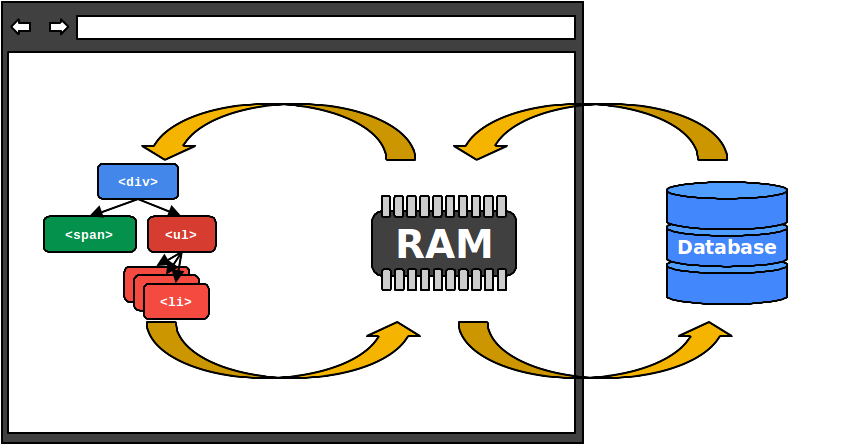
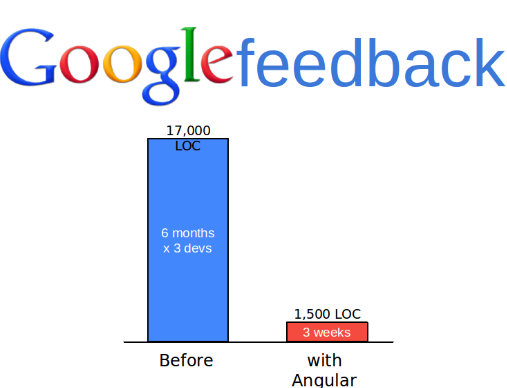
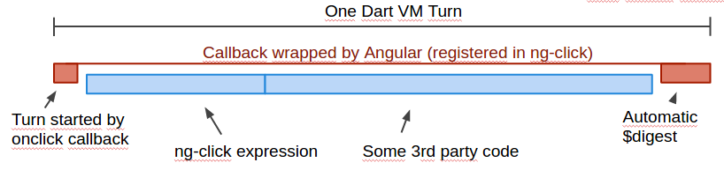

## Dart, it's Angular too!

[Pierre Reliquet](http://github.com/PierreReliquet) - @preliquet

Consultant [@ZenikaIT](http://zenika.com/)


## Agenda

1. Dart, a quick tour
1. Angular
1. AngularDart
1. What's in the future?


<figure>
  
</figure>


## What ?

* `Web` programming language
* `Client` and `server` side
* Open source and `standardized` (ECMA-408)
* One of the `20 most popular programming language` according to Tiobe index
* Active community
* Developped and supported by `Google`


## Why ? 

<figure>
   
</figure>


## Dart goals

* Create a `whole ecosystem`:
 * Package manager : pub
 * Dedicated IDE or plugins
 * Dartium & dart2js
* Easy to learn
* High productivity & [performances](https://www.youtube.com/watch?v=FqsU3TbUw_s)

<figure>
   
</figure>


## It is familiar

```Dart
@Injectable
class Conference {
  List<Attendee> attendees = []; // var attendees = [];

  Conference(this.attendees);
  Conference operator +(Conference other) {
    return new Conference(this.attendees + other.attendees);
  }
  void askQuestions({int number :1}) { ... }
  String toString() => "${attendees.length} attendees participated to the conference";
}
```


## But it is not JavaScript

No `undefined` just `null`

Only `true` is truthy

Real lexical scoping


## "Callback Hell" aka "Pyramid of Doom"

```Dart
myapp.asyncOperation1(function(firstData) {
  // Success
  myapp.asyncOperation2(firstData, function(secondData) {
   // Success
   myapp.asyncOperation3(secondData, function(thirdData) {
     myapp.treatData(thirdData);
   }, function(err) {
     // Error handling
   });
  }, function(err) {
     // Error handling
  });
  }, function(err) {
  // Error Handling
});
```


## Native Future are great

```Dart
asyncOp1()
 .then((var firstData) => asyncOp2(firstData))
 .then((var secondData) => asyncOp3(secondData))
 .then((var thirdData) => treatData(thirdData))
 .catchError((e) => print(e));
```


## Many other great things

* Isolates
* Deferred loading
* Tree shaking


<figure>
	
</figure>


## Angular

* Created in 2009
* First stable release 2012
* Developped and supported by `Google`
* One fact : `all the webapps are the same`
* One aim : enable `webdesigners` to build webapp


## 2-way binding
<figure>
  
</figure>


## Imperative programming is hard to follow
Some imperative programming : 
```Html
<div id="mydiv">
 <h1>Foo</h4>
 <div>Bar</div>
</div>
```
With the following lines hidden among 20 000 lines of JS :
```JavaScript
$('#mydiv').on('click', function() {
  console.log('foo');
});
```


## Declarative programming is better
Some declarative HTML : 
```Html
<div ng-click="log()">
 <h1>Foo</h4>
 <div>Bar</div>
</div>
```
And the corresponding JS function : 
```JavaScript
function log() {
  console.log('foo');
}
```


<figure>
  
</figure>


## Angular has been ported to Dart!


<figure>
	
</figure>


## Context

* `Rewriting` of Google internal CRM
* Project defined as "`widow maker project`" by Seth Ladd
* Team : Green tea - 12 engineers
* Legacy : Java / GWT application
* Decisions made : 
 * rewrite `completely` the tool
 * port `Angular` to `Dart`
 
=> CRM rewritten in 6 months


## How ?
* Porting the `test harness` and make it pass
* Not alone, they had help :
 * Angular core team
 * Dart core team
 


## More than a port !

* `Fully` rewritten
* All the standard features
 * Directives
 * Decorators / Components
 * Formatters
* Plus some `Dartisms`


## Dartisms ?

* Type based [DI](http://www.youtube.com/watch?v=_OGGsf1ZXMs) (Vojta Jina's talk at ngConf)
* `Annotations` 
 * Add meta information to existing class
 * Standardization of declaration 
   * Controller, Component, Formatter ...
* `Web standards` : 
 * Web components => Shadow DOM
* [Zones](http://www.youtube.com/watch?v=3IqtmUscE_U) (Brian Ford's talk at ngConf)
* Uniformi


## Zone ? What's that beast ?

A zone is a "dynamic extent `including asynchronous callbacks` declared in the zone" which means an execution context.
<figure>
    
</figure> 

`No more` : $scope.$apply()


## Bootstrapping an application

Include dart file and declare your Angular application : 
 
```HTML
<html ng-app>
  <!-- scripts should be declared normally -->
  <!-- script:  src="packages/shadow_dom/shadow_dom.min.js"-->
  <!-- script:  type="application/dart" src="addressbook.dart"-->
  <!-- script:  src="packages/browser/dart.js"-->
</html>
```


## Bootstrapping an application

```Dart
main() {
  applicationFactory()
      ..addModule(
        new Module()
          ..bind(ContactList)
          ..bind(Contacts)
        )
      ..run();
}
```


## Controllers

Declaring a controller : 
```Dart
@Controller(selector: '[contact-list]', publishAs: 'contactList')
class ContactList {
  List<Contact> contacts = [ new Contact(...), new Contact(...)];
}
```
Using it in a template : 
```Html
<div class="row" contact-list>
  <li ng-repeat="contact in contactList.contacts">
    <a href="">
    {{contact.firstName}} {{contact.lastName}}
    </a>
  </li>
</div>
```


## Services

Creating a service : 
```Dart
@Injectable()
class Contacts {
  List<Contact> contacts = [ new Contact(...), new Contact(...)];
}
```
Use it through DI : 
```Dart
@Controller(selector: '[contact-list]', publishAs: 'contactList')
class ContactList {
  Contacts contactsSvc;
  List<Contact> contacts;

  ContactList(this.contactsSvc) {
    contacts = contactsSvc.contacts;
  }
}
```


## Directives

* Directives have been splitted into : 
 * Decorator
   * Add behaviour to existing HTML element
 * Component
   * Create custom HTML element
   * Subset of web components


## Components
Declare the VCard : 
```Dart
@Component(
    selector: 'vcard',
    publishAs: 'vcard',
    templateUrl: 'packages/angulardart_flight_school/components/vcard/vcard_component.html',
    cssUrl: 'packages/angulardart_flight_school/components/vcard/vcard_component.css'

)
class VCard {
  @NgTwoWay('contact')
  Contact contact;
}
```
Use your component : 
```Html
<vcard contact="contact" class="span4" ng-repeat="contact in contactList.contacts"></vcard>
``` 


## Components
The template looks like : 
```Html
 <div class="contact-card">
    <div class="contact-card-inner">
        <h4>
          {{vcard.contact.firstName}} {{vcard.contact.lastName | uppercase}}
        </h4>

        <div class="contact-address">{{vcard.contact.address}}</div>
        <div class="contact-phone">{{vcard.contact.phone}}</div>
    </div>
</div>
```
Web components are awesome : 

* Already available through `Polymer`
* No more `CSS leak`


## Decorators
Customize existing HTML : 
```Dart
@Decorator(selector: '[tooltip]')
class Tooltip {
  Element _elm;
  
  @NgOneWay('tooltip')
  Contact tooltip;

  Tooltip(this._elm) {
    this._elm.onMouseEnter.listen((MouseEvent e) {
      DivElement div = new Element
        .html("<div id='tooltip'>${tooltip.address} - ${tooltip.phone}</div>");
      div.style
        ..position = 'absolute'
        ..left = '${e.page.x + 10}px'
        ..top = '${e.page.y + 10}px'
        ..padding = '5px'
        ..borderRadius = '5px'
        ..backgroundColor = 'white'
        ..border = 'solid 1px black';
      document.body.append(div);
    });
    this._elm.onMouseLeave.listen((MouseEvent e) {
      var tooltip = document.querySelector('#tooltip');
      if (tooltip != null) {
        tooltip.remove();
      }
    });
  }
}
```


## Filters aka Formatters

Filters were meant to `format data` for display

Declare them is easy : 
```Dart
@Formatter(name: "doSearch")
class SearchFilter {
  List<Contact> call(List<Contact> contacts, String search) {
    if (search == null) {
      return contacts;
    }
    return contacts.where(
        (Contact c) => (
            c.firstName.toLowerCase().contains(search.toLowerCase()) ||
            c.lastName.toLowerCase().contains(search.toLowerCase()))
        ).toList();
  }
}
```

&#9888; No `selector` but a `name`

&#9888; The method must be named `call`


## Routing is powerful

Similar to `ui-router` : 
```Dart
void addressBookRouter(Router router, RouteViewFactory views) {
  views.configure({
    'list': ngRoute(
      path: '/list',
      view: 'partials/list.html',
      defaultRoute : true),
    'contact': ngRoute(
          path: '/contact/:id',
          mount: {
            'edit': ngRoute(
                path: '/edit',
                view: 'partials/edit.html'
            ),
            'view': ngRoute(
                path: '/view',
                view: 'partials/view.html'
            )
          })
  });
}
```


<figure>
  
</figure>


## Angular.dart

* Version 1.0 is a `WIP`
 * Some features to deliver
 * Some to clean up / remove
* Used by `Google` and `Netflix` in production


## Angular two

* Written in ES6
* Many learnings from AngularDart backported
 * Type based DI
 * Annotations ? 
 * Zones
 * Dirty checking


`AngularDart` is not about `Dart`.

Such as `AngularJS` is not about `JS`. 

It is all about making the web a better development platform.


## Thank you!


## Questions? 


## Appendix : EcmaScript 6

* Classes
* Modules
* Inheritance
* Annotations ? (Not yet standardized)

* Available today through [traceur](https://code.google.com/p/traceur-compiler/)


## Appendix : EcmaScript 6

Some ES6 code : 

```
import {
  ChangeDetector
} from './change_detection.js';

export class DirtyCheckingChangeDetectorGroup extends ChangeDetector {
  constructor(parent, cache) {
    this._parent = parent;
    this._getterCache = cache;
  }
  watch(context, field, handler) { ... }
}
```
Looks familiar no ? 
