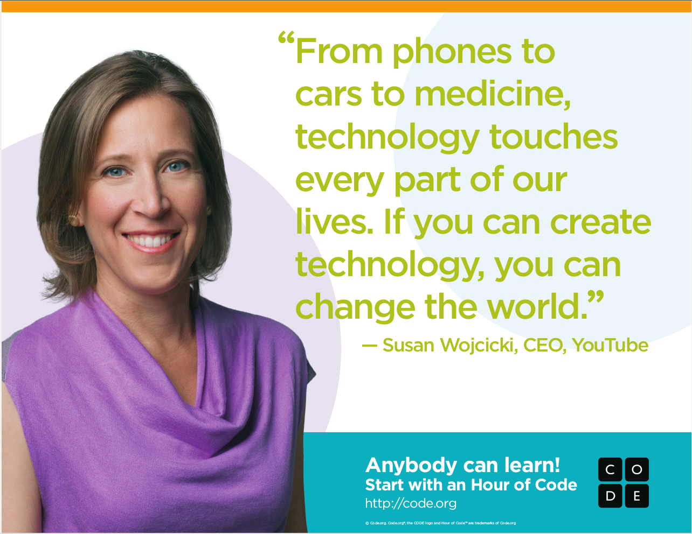
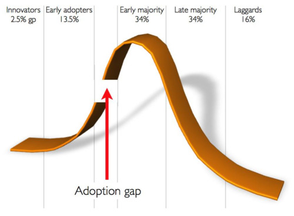
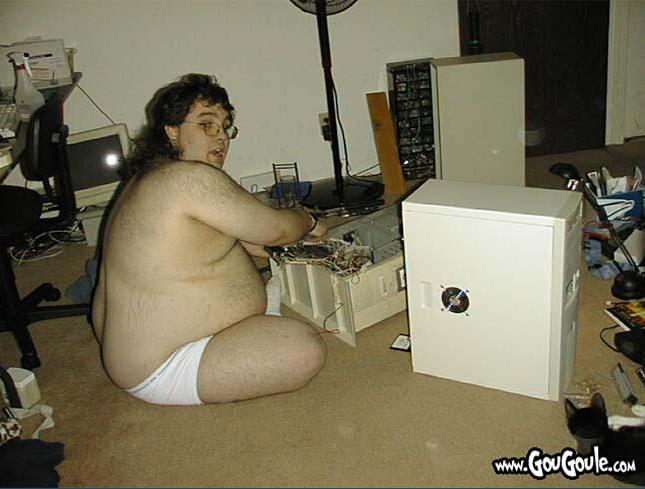
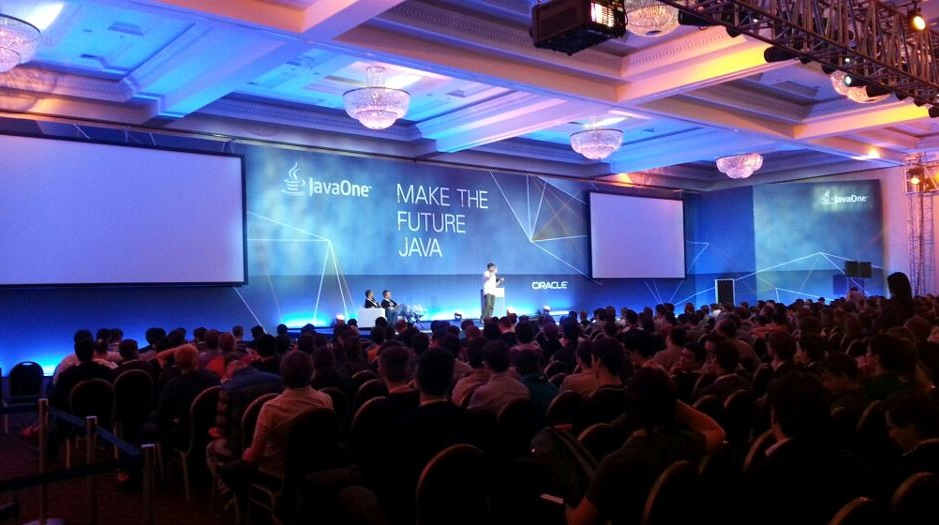
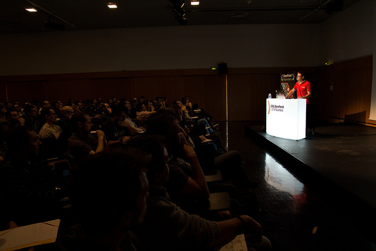

## Why become an IT engineer ?

[Pierre Reliquet](http://github.com/PierreReliquet) - @preliquet

Consultant [@ZenikaIT](http://zenika.com/)

## To `change` the `world`!

### IT is `everywhere`

<figure>
  
</figure>

### IT is a `permanent challenge`

>"Le but de cet enseignement est de d&eacute;montrer le foss&eacute; existant entre notre pens&eacute;e humaine, intuitive et cr&eacute;atrice mais lente et moyennement rigoureuse, et la machine qui, elle, est extr&ecirc;mement rapide, totalement rigoureuse mais absolument stupide."

G&eacute;rard Berry - Professeur au coll&egrave;ge de France

<figure>
  
</figure>
Rogers' adoption curve

### IT `engineers` love to share

### The existing clich&eacute; is wrong
<figure>
  
</figure>

### Sharing knowledge is `everything`
<figure>
  
</figure>

### But experience `does not` matter

<figure>
  
</figure>

## The `end`
